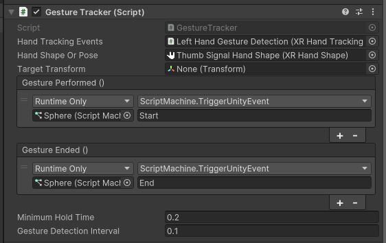

# STYLY Hands Unity package

This package provides utilities for hand tracking. Currently a script to track hand gestures is provided.

# How to use the tracker
In your scene please prepare an object which has `UnityEngine.XR.Hnads.XRHandTrackingEvents` component. Please add `Styly.Hands.GestureTracker` component to the object you want to track.

## Component setup
1. Set `UnityEngine.XR.Hands.XRHandTrackingEvents` component to `Hand Tracking Events` field.
2. Set your `Hand Pose` or `Hand Shape` asset in `Hand Shapoe Or Pose` field. 
3. Set up `Gesture Performed` and `Gesture Ended` events to receive gesture events (Unity Event).
